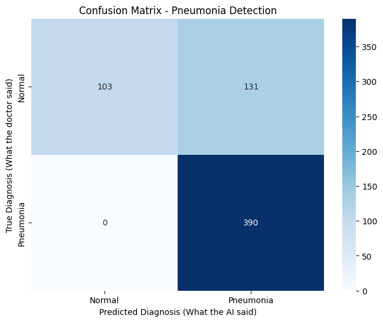

# 🫁 Medical Image Classifier: Pneumonia Detection

## 📌 Problem Statement
Medical imaging is a critical tool for diagnosing diseases, but analyzing scans manually is time-consuming and prone to human error. This project utilizes Deep Learning to automatically classify medical images (Chest X-rays) to detect anomalies, assisting doctors in early diagnosis and treatment.

## 🚀 Project Overview
This repository contains an end-to-end Machine Learning pipeline that classifies Chest X-Ray images as either **Normal** or **Pneumonia**. The model leverages a Convolutional Neural Network (CNN) with **Transfer Learning (VGG16)** to extract complex visual features from the X-rays, ensuring high accuracy and minimizing false-negative diagnostic rates.

## 🛠️ Tech Stack
* **Language:** Python
* **Deep Learning Framework:** TensorFlow & Keras
* **Model Architecture:** VGG16 (Pre-trained on ImageNet) + Custom Dense Layers
* **Data Visualization:** Matplotlib
* **Environment:** Jupyter Notebook / VS Code

## 📂 Dataset
The model is trained on the standard [Chest X-Ray Images (Pneumonia)](https://www.kaggle.com/paultimothymooney/chest-xray-pneumonia) dataset from Kaggle. 
* The data was dynamically loaded and preprocessed using TensorFlow's `image_dataset_from_directory`.
* Images were resized to uniform dimensions (224x224) and batched for memory-efficient training.

## 🧠 Model Architecture
Instead of building a CNN from scratch, this project uses **Transfer Learning**. 
1. **Base Model:** VGG16 (weights frozen to retain learned feature extraction).
2. **Flattening:** Converts the 2D feature maps into a 1D vector.
3. **Dense Layers:** A fully connected layer (128 neurons, ReLU activation).
4. **Dropout:** Set to 0.5 to prevent the model from overfitting the medical data.
5. **Output Layer:** A single neuron with a Sigmoid activation function for binary classification (0 = Normal, 1 = Pneumonia).

## 📊 Results & Visualizations


*The model achieved a 79% accuracy on the unseen test dataset. The confusion matrix above illustrates the model's performance in distinguishing between Normal and Pneumonia cases.*

## ⚙️ How to Run Locally
1. Clone the repository:
   ```bash
   git clone [https://github.com/keshavbs342/Medical-Image-Classification.git](https://github.com/keshavbs342/Medical-Image-Classification.git)

## 👨‍💻 Author

**Keshav Shukla** *B.Tech in Electronics and Communication Engineering | Shri Ramdeobaba College of Engineering and Management*

* 📧 **Email:** [keshavbs342@gmail.com](mailto:keshavbs342@gmail.com)
* 🐙 **GitHub:** [@keshavbs342](https://github.com/keshavbs342)
* 💡 **Focus:** Python, Natural Language Processing (NLP), and Machine Learning
